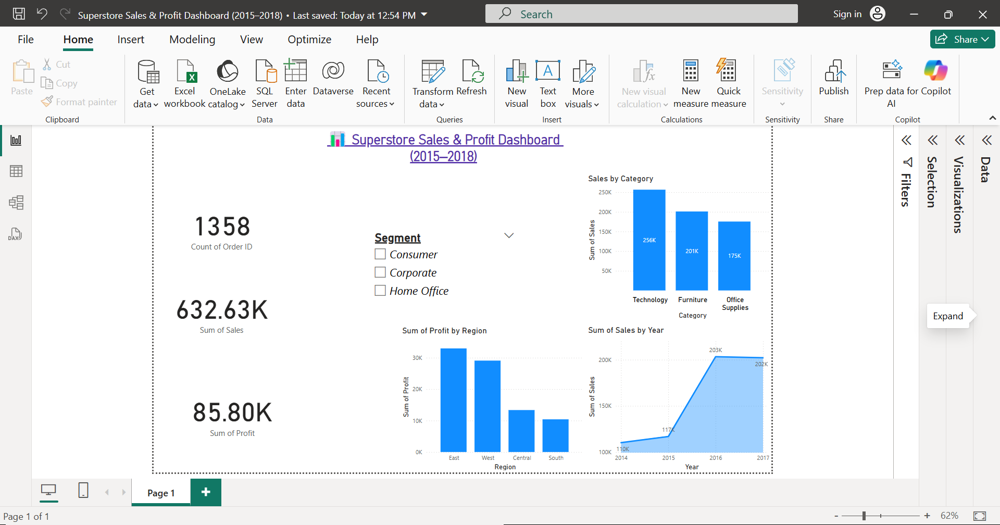

# 📊 Superstore Sales Dashboard (Power BI)

An interactive sales dashboard built using Power BI based on the Superstore dataset. This project demonstrates data cleaning, transformation, and visualization to derive business insights across sales, profit, customer segments, and regional performance.

---

## 📁 Contents

- `Superstore_dashboard.pbix` – Power BI file with cleaned data and visualizations  
- `dashboard_preview.png` – Visual screenshot of the dashboard  
- `DATA_SOURCE.md` – Dataset source information  
- `README.md` – Project overview and instructions

---

## 🚀 Dashboard Features

- Key Performance Indicators (KPIs)  
- Sales and Profit Trends  
- Region and Category-wise Breakdown  
- Customer Segment Analysis  
- Interactive Slicers for Filtering

---

## 🧹 Data Cleaning Summary

- Removed duplicate rows  
- Fixed data type issues (especially Order Date)  
- Handled null and error values  
- Renamed columns for clarity

---

## 🛠️ How to Use

1. Download [Power BI Desktop](https://powerbi.microsoft.com/)  
2. Open `superstore_dashboard.pbix`  
3. Use **Transform Data** to view cleaning steps  
4. Explore the visuals and interact with filters

---

## 📷 Dashboard Preview

---

## 🔗 Dataset Source

[Superstore Dataset – Kaggle](https://www.kaggle.com/datasets/vivek468/superstore-dataset-final)

---
## 🤝 Author

**Parampreet Singh Ahluwalia**  
Elevate Labs Internship – Data Task  
[LinkedIn Profile](https://www.linkedin.com/in/parampreet-singh-ahluwalia-0704582b1/)
